# ACUTE Lab Website — Content Management Guide

This guide explains how to use the ACUTE Content Manager (CMS) to edit the lab website without touching code.

---

## Table of Contents

**Already set up?** Jump straight to [Quick Start](#quick-start-already-set-up).

1. [Getting Started](#1-getting-started)
2. [Setting Up SSH for GitHub](#2-setting-up-ssh-for-github)
3. [The Dashboard](#3-the-dashboard)
4. [Managing Publications](#4-managing-publications)
5. [Managing Team Members](#5-managing-team-members)
6. [Managing Blog Posts](#6-managing-blog-posts)
7. [Managing Research Areas](#7-managing-research-areas)
8. [Managing Projects](#8-managing-projects)
9. [Managing Facilities](#9-managing-facilities)
10. [Managing Featured Research](#10-managing-featured-research)
11. [Managing the Stats Ticker](#11-managing-the-stats-ticker)
12. [Managing Partners & Funders](#12-managing-partners--funders)
13. [Image Manager](#13-image-manager)
14. [Previewing the Website](#14-previewing-the-website)
15. [Publishing Your Changes](#15-publishing-your-changes)
16. [Troubleshooting](#16-troubleshooting)

---

## Quick Start (Already Set Up?)

If this computer has **already** been through the one-time setup — tools installed, SSH key added, and the website cloned — you can skip the rest of Getting Started. This is the entire day-to-day workflow:

1. Open your terminal — **Git Bash** on Windows, **Terminal** on macOS.
2. Go to your website folder, pull the latest changes, and start the CMS:

```bash
cd <your website folder>/acute_web    # e.g. /d/work/acute_web — the folder you cloned earlier
git pull origin main                  # get colleagues' latest changes
cd cms
npm run dev                           # start the CMS
```

3. Open your browser at **http://localhost:3000** and edit content.
4. When done, **publish** from the **Deploy** page (or the orange **Build + Commit + Push** button — see [Section 15](#15-publishing-your-changes)).
5. Back in the terminal, press **Ctrl+C** to stop the CMS.

> **Tip (Windows):** skip typing the folder path — in File Explorer, right-click inside your `acute_web` folder and choose **Git Bash Here** to open a terminal already in the right place.
>
> **First time on this computer, or unsure where your folder is?** Start with [Section 1: Getting Started](#1-getting-started).

---

## 1. Getting Started

First-time setup on a new computer happens in **four stages**. Do Stages A–C in order; Stage D is optional. After this one-time setup you only ever repeat the [Quick Start](#quick-start-already-set-up) workflow.

| Stage | What you do | What it's for | Required? |
|-------|-------------|---------------|-----------|
| **A — Install the tools** | Install **Node.js** + **Git** | Running the CMS on your computer | ✅ Required |
| **B — Set up SSH** | Add a GitHub **SSH key** | **Publishing** (pushing) your changes | ✅ Required |
| **C — Get the website** | **Clone** the repo into a folder you choose | Having the website files locally to edit | ✅ Required (once) |
| **D — Ruby + Jekyll** | Install **Ruby + Jekyll** | The optional local **Preview** only | ⬜ Optional |

You can edit and publish the whole website with just Stages A–C. Stage D only adds the in-browser **Preview** and is covered in [Section 14](#14-previewing-the-website) — feel free to skip it for now.

### Which terminal to use

| Operating System | Terminal |
|-----------------|----------|
| **Windows** | Open **Git Bash** (installed with Git for Windows). Search for "Git Bash" in the Start menu, or right-click inside a folder and choose **Git Bash Here**. |
| **macOS** | Open **Terminal** (Applications > Utilities > Terminal) |

All commands in this guide work in both Git Bash (Windows) and Terminal (macOS). **Windows users: use Git Bash, not Command Prompt (cmd).**

### Stage A — Install the tools

Install both of these:

- **Node.js** (version 20 or higher) — [download here](https://nodejs.org) — runs the CMS.
- **Git** — [download here](https://gitforwindows.org/) — downloads and publishes the website. On Windows, install **"Git for Windows"** with all defaults; this also gives you **Git Bash**.

#### Installing Node.js (Windows)

The [nodejs.org](https://nodejs.org) download page offers several options — here is exactly what to pick:

1. Choose the big **LTS** button (not "Current"). LTS is the stable, long-term-support release. The exact version number doesn't matter as long as it's the current LTS — this project works on any LTS (20, 22, or newer).
2. Download the **Windows Installer (.msi)**, **64-bit** version. This is correct for virtually every Windows laptop. Only choose **ARM64** if you have an ARM-based PC (e.g. a Snapdragon device) — this is rare.
3. Run the installer and **keep all the defaults**. You do **not** need to tick the optional "Tools for Native Modules" / Chocolatey checkbox.
4. To confirm it worked, open **Git Bash** and run `node -v` — you should see a version number.

> **You do not need Docker.** The CMS is a plain Node.js app — just install Node.js and run `npm install`. Docker would add a large download and extra complexity for no benefit here.

### Stage B — Set up an SSH key

You need a GitHub SSH key to **publish** your changes. This is a one-time setup per computer. Follow **[Section 2: Setting Up SSH for GitHub](#2-setting-up-ssh-for-github)** now, then come back here for Stage C.

### Stage C — Get the website (clone)

#### Step 1 — Choose where to store the website

The website folder can live **anywhere you like** — it does **not** have to be in Documents. Another drive (e.g. `D:`) or an external disk is fine. Just pick a spot you'll remember, and ideally:

- **avoid** folders synced by OneDrive / Dropbox / iCloud (syncing can corrupt the project files), and
- **avoid spaces** in the folder path where possible.

#### Step 2 — Open a terminal *inside* that folder

The clone command downloads into wherever your terminal currently is, so get your terminal into your chosen folder first. The easiest ways avoid typing any path by hand:

**Windows — "Git Bash Here" (recommended):**

1. In File Explorer, open (or create) the folder where you want the website to live.
2. Right-click an empty area inside it → on Windows 11 click **Show more options** first → choose **Git Bash Here**.
3. A terminal opens already located in that folder. Done — go to Step 3.

**Windows — copy the path instead:**

1. In File Explorer, click once in the **address bar** at the top; it turns into text like `D:\work`. Copy it (**Ctrl+C**).
2. In Git Bash, type `cd ` (with a trailing space), then paste (**Shift+Insert**, or right-click → Paste).
3. Git Bash expects forward slashes and a lowercase drive letter, so convert `D:\work` → `/d/work`, and press Enter. Example: `cd /d/work`

**macOS:**

- Type `cd ` (with a trailing space) in Terminal, then **drag the folder from Finder onto the Terminal window** — the full path is inserted automatically. Press Enter.
- Or right-click the folder in Finder, hold **⌥ Option**, choose **Copy "…" as Pathname**, then paste after `cd `.

#### Step 3 — Clone the website

With your terminal now inside your chosen folder, download the website:

```bash
git clone git@github.com:Acute-hi-is/Acute-hi-is.github.io.git acute_web
```

This creates a new **`acute_web`** folder inside your chosen location, containing the whole website.

> **Write down your path.** From now on the website lives at *your folder* + `/acute_web`, and you'll go there every time you work. Example: Windows `D:\work` → in Git Bash that's **`/d/work/acute_web`**.

#### Step 4 — Install the CMS (one time)

```bash
cd acute_web/cms
npm install
```

This downloads everything the CMS needs. It only has to be done once (and again after any CMS update).

### Starting the CMS (every time)

```bash
cd <your website folder>/acute_web    # e.g. /d/work/acute_web  (or use "Git Bash Here")
git pull origin main                  # get colleagues' latest changes
cd cms
npm run dev                           # start the CMS
```

Open your browser and go to **http://localhost:3000**.

### Stopping the CMS

Press **Ctrl+C** in the terminal.

---

## 2. Setting Up SSH for GitHub

To publish changes from the CMS, your computer needs an SSH key linked to your GitHub account. You only need to do this **once per computer**.

If you can already push to GitHub (test with `ssh -T git@github.com`), skip this section.

### Step 1: Open your terminal

- **Windows:** Open **Git Bash** (search for it in the Start menu)
- **macOS:** Open **Terminal** (Applications > Utilities > Terminal)

### Step 2: Check if you already have an SSH key

Type:

```bash
ls ~/.ssh/id_ed25519.pub
```

- If you see a file path, **you already have a key** — skip to Step 4
- If you see "No such file or directory", continue to Step 3

### Step 3: Generate a new SSH key

Type (replace with your email):

```bash
ssh-keygen -t ed25519 -C "your-name@hi.is"
```

You will be asked three questions. **Press Enter for all three** to accept the defaults:

```
Enter file in which to save the key (/c/Users/YourName/.ssh/id_ed25519): [press Enter]
Enter passphrase (empty for no passphrase): [press Enter]
Enter same passphrase again: [press Enter]
```

You should see output like:

```
Your identification has been saved in /c/Users/YourName/.ssh/id_ed25519
Your public key has been saved in /c/Users/YourName/.ssh/id_ed25519.pub
```

### Step 4: Copy your public key

Type:

```bash
cat ~/.ssh/id_ed25519.pub
```

This prints a long line starting with `ssh-ed25519 AAAA...` and ending with your email.

**Select the entire line** and copy it:
- **Windows (Git Bash):** select with mouse, right-click > Copy (or Ctrl+Insert)
- **macOS:** select with mouse, Cmd+C

### Step 5: Add the key to GitHub

1. Open your browser and go to: **https://github.com/settings/keys**
   - If you're not logged in, log in first
2. Click the green **New SSH key** button
3. Fill in:
   - **Title**: a name for this computer (e.g. "Lab laptop" or "Office PC")
   - **Key type**: keep as "Authentication Key"
   - **Key**: paste the key you copied in Step 4
4. Click **Add SSH key**
5. GitHub may ask you to confirm your password

### Step 6: Test the connection

Back in your terminal, type:

```bash
ssh -T git@github.com
```

If this is your first time connecting, you'll see:

```
The authenticity of host 'github.com' can't be established.
Are you sure you want to continue connecting (yes/no)?
```

Type **yes** and press Enter.

You should then see:

```
Hi YourUsername! You've successfully authenticated, but GitHub does not provide shell access.
```

If you see this message, **you're done**. You can now push changes from the CMS.

If it doesn't work, see [Section 16: Troubleshooting](#16-troubleshooting).

---

## 3. The Dashboard

When you open the CMS, you land on the **Dashboard**.

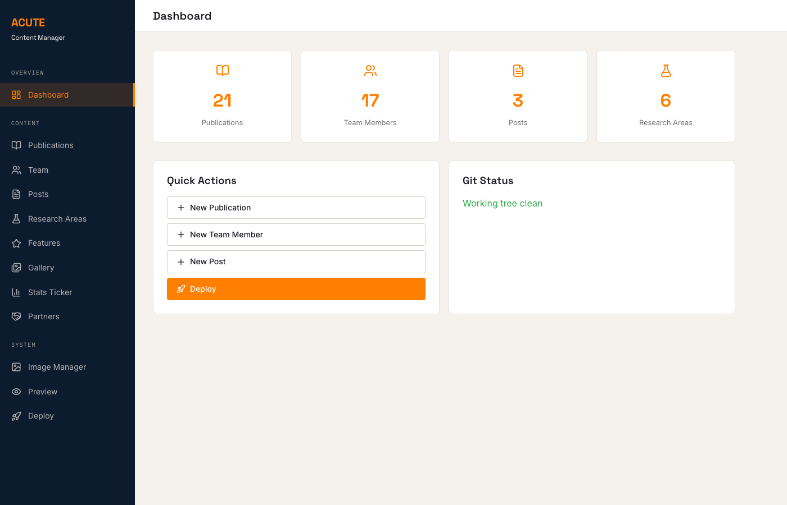

The dashboard shows:

- **Content counts** — how many publications, team members, posts, and research areas exist
- **Quick Actions** — shortcuts to create new content or deploy changes
- **Git Status** — whether you have unsaved (uncommitted) changes

---

## 4. Managing Publications

Click **Publications** in the sidebar.

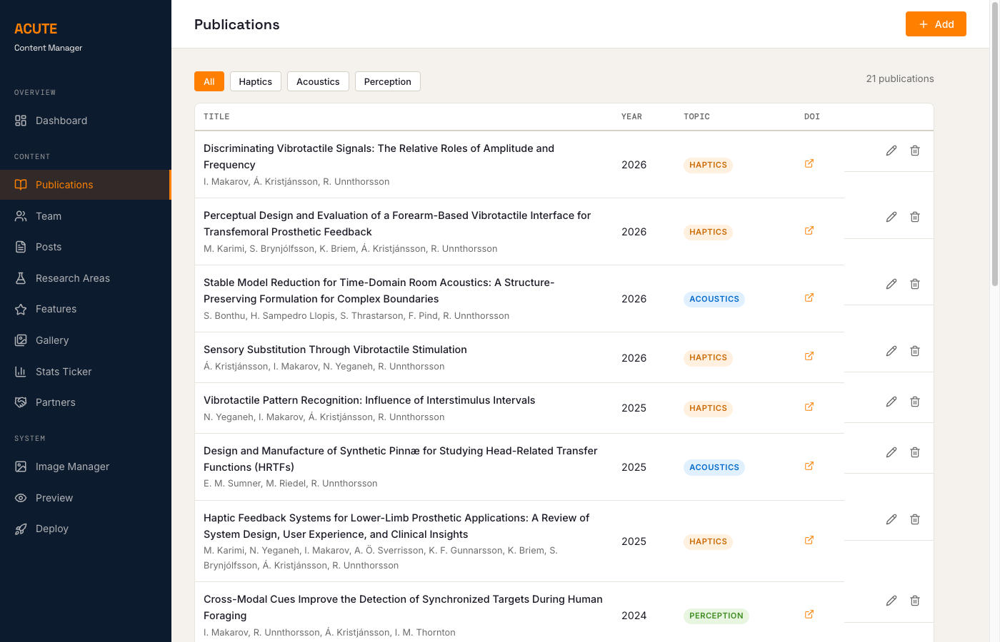

### What you see

- A list of all publications sorted by year (newest first)
- **Filter buttons** at the top: All, Haptics, Acoustics, Perception
- Each row shows the title, authors, year, topic badge, and a DOI link

### Adding a new publication

1. Click the orange **+ Add** button (top right)
2. Fill in the form:

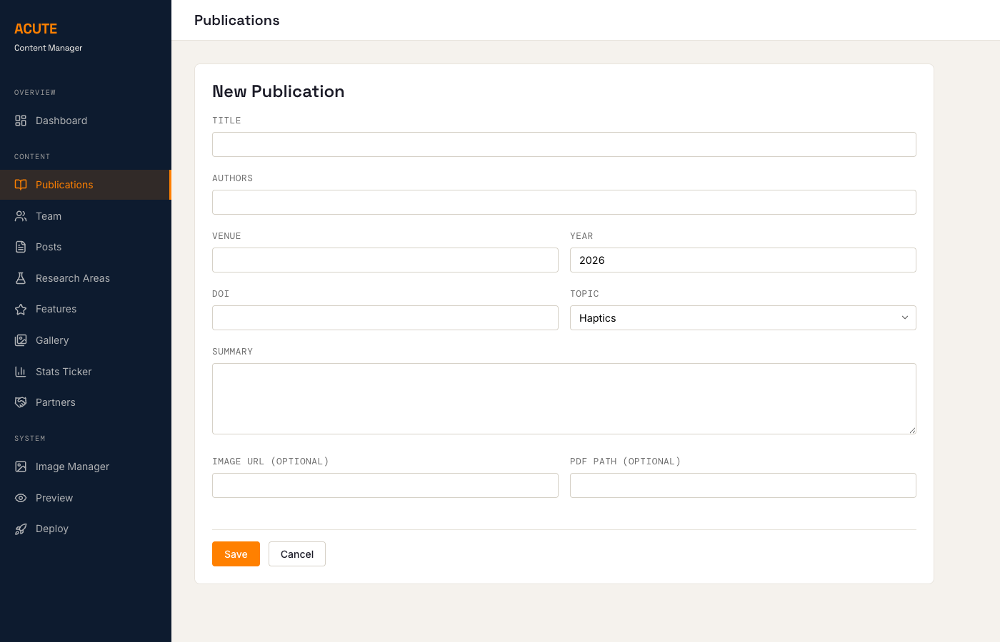

| Field | What to enter |
|-------|--------------|
| Title | Full paper title |
| Authors | Author names, comma-separated (e.g. "I. Makarov, R. Unnthorsson") |
| Venue | Journal or conference name |
| Year | Publication year |
| DOI | The DOI identifier (e.g. "10.3390/s25010001") |
| Topic | Select: Haptics, Acoustics, or Perception |
| Summary | A 1-2 sentence description of the paper |
| Projects | Optional. Tick the project(s) this paper belongs to (see below) |
| Image URL | Optional — path to a thumbnail image |
| PDF Path | Optional — path to a locally hosted PDF |

3. Click **Save**

### Linking a publication to a project

Publications and a project's **Key publications** are now **one list** — you manage both from here. On a paper, tick the **Projects** it belongs to, and it automatically appears under "Key publications" on those project pages (as well as on the main Publications page). You do **not** add publications inside the Projects editor anymore — a paper only needs to be entered once, here.

### Editing a publication

Click the pencil icon on any row. The form opens with the current values. Make your changes and click **Save**.

### Deleting a publication

Click the trash icon on any row. A confirmation dialog appears — click **Delete** to confirm.

---

## 5. Managing Team Members

Click **Team** in the sidebar.

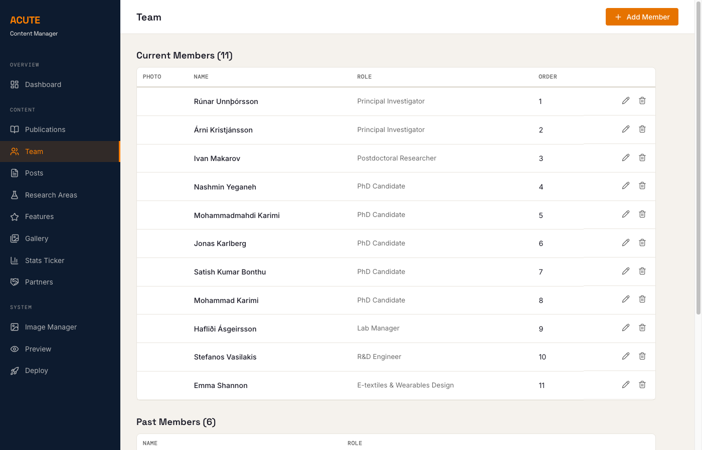

Members are grouped into **Current Members** and **Past Members**.

### Adding a new team member

1. Click **+ Add Member** (top right)
2. Fill in:
   - **Name** — full name
   - **Role** — e.g. "PhD Candidate", "Postdoctoral Researcher"
   - **Photo** — click Upload to add a photo (auto-compressed to 400x400)
   - **Email** — optional
   - **Profile URL** — optional link to university page
   - **Status** — "current" or "past"
   - **Order** — display order (lower numbers appear first)
   - **Research Project** — optional; pick the member's main project from the dropdown (choose "— None —" to leave it unset)
   - **Bio** — write in the text area. This supports Markdown formatting
3. Click **Save**

### Linking a member to their research project

The **Research Project** dropdown ties a member to one of the projects on the [Projects page](#8-managing-projects). When set, a link to that project appears:

- on the **homepage**, in the pop-up bio panel that opens when you click a team member (next to "Read more"), and
- on the member's own **profile page**, below their bio.

The dropdown lists every project you've created. Leave it on **"— None —"** for people without a single main project (e.g. principal investigators or external collaborators). To change or remove the link later, edit the member, pick a different project (or "— None —"), and save.

### Moving a member to "Past"

Edit the member, change **Status** from "current" to "past", and save.

### Editing a bio

Click the pencil icon on any member. The bio field supports Markdown:

- `**bold text**` for bold
- `*italic text*` for italic
- `[link text](url)` for links
- Blank lines for new paragraphs

---

## 6. Managing Blog Posts

Click **Posts** in the sidebar.

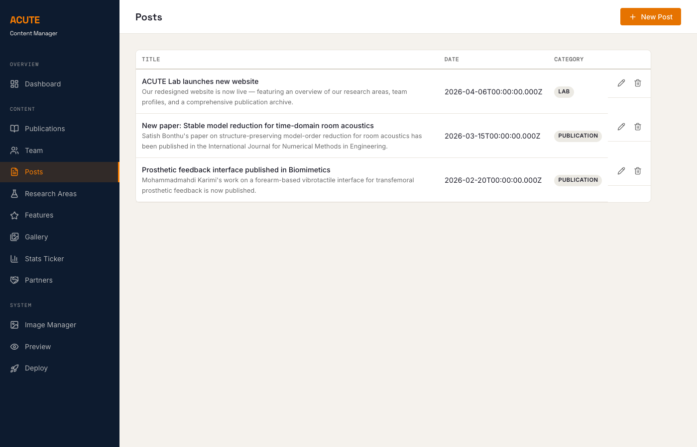

### Adding a new post

1. Click **+ New Post** (top right)
2. Fill in:
   - **Title** — the post headline
   - **Date** — publication date
   - **Category** — e.g. "publication", "lab", "event"
   - **Excerpt** — a short summary (shown on the homepage)
   - **Content** — the full post body (Markdown supported)
3. Click **Save**

The post filename is auto-generated from the date and title.

---

## 7. Managing Research Areas

Click **Research Areas** in the sidebar.

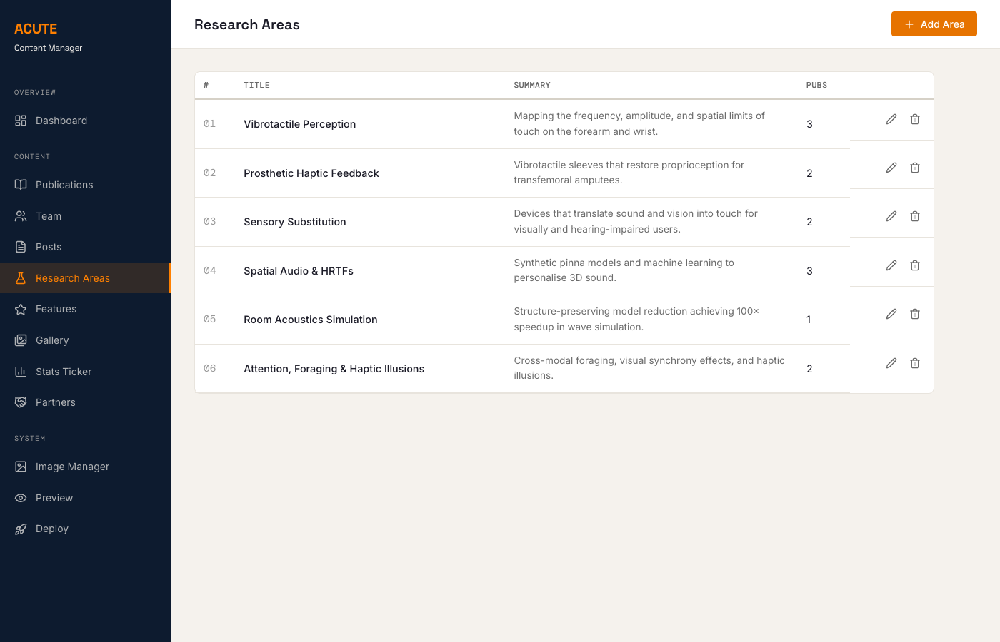

Each research area has a title, summary, description paragraphs, and linked publications.

### Editing a research area

1. Click the pencil icon on any row
2. The form includes:
   - **Title** and **Summary**
   - **Description** — multiple paragraphs (use Add/Remove buttons to manage)
   - **Publications** — the key papers for this area, chosen from the **Publications** section (pick each from the dropdown). Their citations are pulled from Publications automatically, so add the papers there first.
   - **Images** — main image and highlight image
3. Click **Save**

---

## 8. Managing Projects

Click **Projects** in the sidebar.

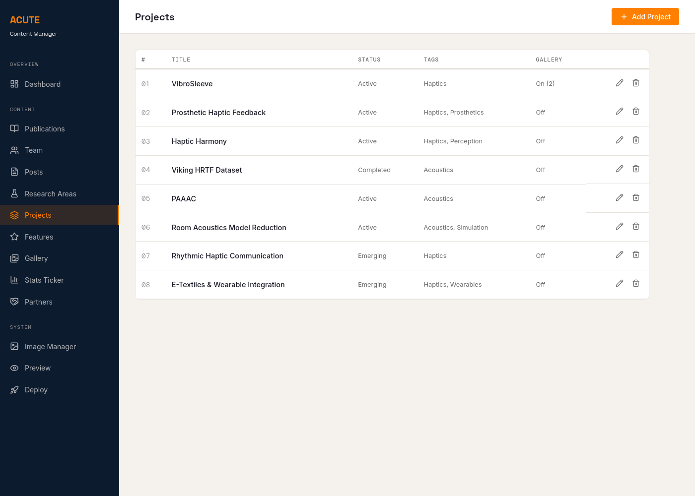

Each project gets its own page at `acute.hi.is/projects/<slug>/`. Projects are sorted by **Display Order** (lower numbers first) on the projects index page, and each can optionally show a **photo & video gallery** at the bottom of its detail page.

> This gallery lives inside an individual project's page and is opt-in per project. (It's separate from the hero photo carousel on the homepage, which is set in the site templates, not the CMS.)

### Adding a new project

1. Click the orange **+ Add Project** button (top right)
2. Fill in:

| Field | What to enter |
|-------|--------------|
| Title | Project title |
| Status | "Active", "Completed", or "Emerging". Drives the badge colour on the projects index. |
| Tags | Comma-separated keywords (e.g. "Haptics, Wearables"). Shown as chips on the index card. |
| Display Order | Lower numbers appear first on the projects index. |
| Team | People involved (free text — e.g. "Stefanos V., Runar U.") |
| Partners | Collaborating institutions or companies |
| Funding | Grant / funder names |
| Description | Body content in **Markdown**. Appears as the main column of the project page. |

3. Click **Save**

> **Key publications are managed in the Publications section, not here.** To show a paper under a project's "Key publications", open it in the **Publications** section and tick that project under **Projects** (see [Section 4](#4-managing-publications)). It then appears on the project page automatically.

### Adding a photo & video gallery

Each project page can show an optional gallery at the bottom.

1. Edit the project
2. Tick **"Show photo & video gallery on this project page"**
3. The **Gallery Items** editor appears. Click **+ Add Photo** or **+ Add Video** to add an item
4. Reorder items with the ▲ ▼ arrows on each row; delete with the ✕

**For photo items:**

- Click **Upload** to add an image. Uploaded photos are auto-compressed to max 1400 px wide, JPEG.
- A **"Apply ACUTE watermark to next upload"** checkbox appears above the upload button — leave it checked (the default) to stamp the ACUTE long logo discreetly in the bottom-right corner of the image. Uncheck only if you don't want a watermark on that specific upload (e.g. partner-supplied images that already carry their own branding).
- Fill in **Alt text** (for accessibility) and an optional **Caption** (shown beneath the photo on the live page).

**For video items:**

- Paste an **embed URL** — not the watch URL. YouTube and Vimeo both expose this:
  - YouTube: from `https://www.youtube.com/watch?v=ABC123` → use `https://www.youtube.com/embed/ABC123`
  - Vimeo: from `https://vimeo.com/123456` → use `https://player.vimeo.com/video/123456`
- Add an optional **Caption**.
- Videos render as a responsive 16:9 embed in the gallery grid.

5. Click **Save**

> **Where the gallery appears:** the full gallery (photos and videos) shows at the bottom of the project's own page. In addition, the gallery **photos** now appear as a thumbnail strip on the project's card on the main [Projects page](acute.hi.is/projects/), so visitors get a preview without opening the project. Videos are shown on the project page only.

### Disabling the gallery

Untick **"Show photo & video gallery on this project page"** and save. The gallery items are preserved (in case you want to re-enable later) — they just won't render on the live page.

### Editing or deleting a project

Click the pencil icon on any row to edit, or the trash icon (with confirmation) to delete. Deleting a project removes its source file; uploaded gallery images stay in the repo and can be cleaned up via the [Image Manager](#13-image-manager).

---

## 9. Managing Facilities

Click **Facilities** in the sidebar.

Facilities are the pieces of lab infrastructure available to hire. Each facility gets its own page at `acute.hi.is/facilities/<name>/`, is listed on the **Facilities** page, and appears in the **Facilities** section on the homepage. They are ordered by **Display Order** (lower numbers first).

### Adding a facility

1. Click **+ Add Facility** (top right)
2. Fill in:
   - **Name** — e.g. "Anechoic chamber"
   - **Tag** — a short category shown as a label, e.g. "Acoustics" or "3D metrology"
   - **Summary** — one or two sentences, shown on the homepage cards and the Facilities list
   - **Photo** — optional; click Upload to add an image (auto-compressed). Cards and pages upgrade automatically once a photo is set
   - **External link** — optional; e.g. a manufacturer page. Shown as a "Manufacturer / reference" link on the facility's page
   - **Display Order** — lower numbers appear first
   - **Details** — the full description shown on the facility's own page. Supports Markdown (headings, **bold**, bullet lists, `[links](url)`)
3. Click **Save**

### Editing or deleting a facility

- Click the **pencil** icon to edit, make your changes, and **Save**.
- Click the **trash** icon to delete (confirmation required). Prefer editing over delete-and-recreate so the page address (`/facilities/<name>/`) stays stable.

### Where facilities appear

- **Homepage** — a "Facilities" teaser section with one card per facility.
- **Facilities page** (`/facilities/`) — the full list with summaries.
- **Individual pages** (`/facilities/<name>/`) — the full Details text, photo, external link, and an "Enquire about access" contact button.

---

## 10. Managing Featured Research

Click **Features** in the sidebar.

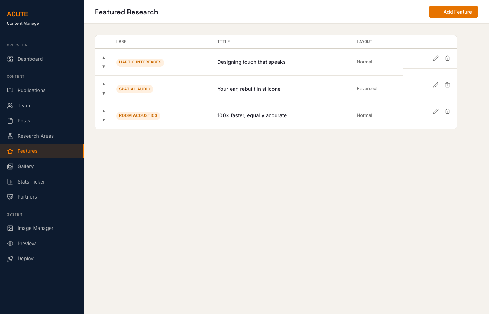

These are the highlighted research sections on the homepage.

### Reordering

Use the up/down arrows on the left of each row to change the display order.

### Editing a feature

Click the pencil icon. You can change the label, title, description text, DOI link, image, and layout direction (Normal or Reversed).

---

## 11. Managing the Stats Ticker

Click **Stats Ticker** in the sidebar.

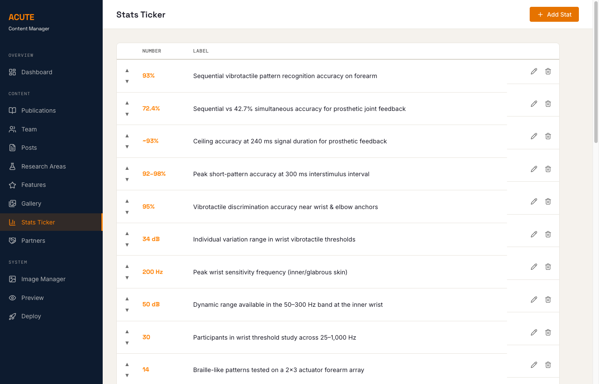

The stats ticker is the scrolling numbers bar on the homepage.

### Adding a stat

1. Click **+ Add Stat** (top right)
2. Enter the **Number** (e.g. "93%", "200 Hz", "34 dB")
3. Enter the **Label** (description of what the number means)
4. Click **Save**

### Reordering

Use the up/down arrows to change the scroll order.

---

## 12. Managing Partners & Funders

Click **Partners** in the sidebar.

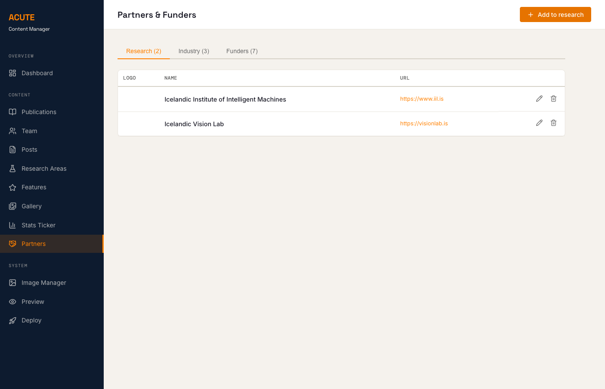

Partners are organized in three tabs:

- **Research** — academic research partners
- **Industry** — industry collaborators
- **Funders** — funding organizations

### Adding a partner

1. Select the correct tab
2. Click the orange **+ Add to [group]** button
3. Fill in the name, website URL, logo (use Upload), and alt text
4. Click **Save**

Logos are auto-compressed to 300x150 pixels.

---

## 13. Image Manager

Click **Image Manager** in the sidebar.

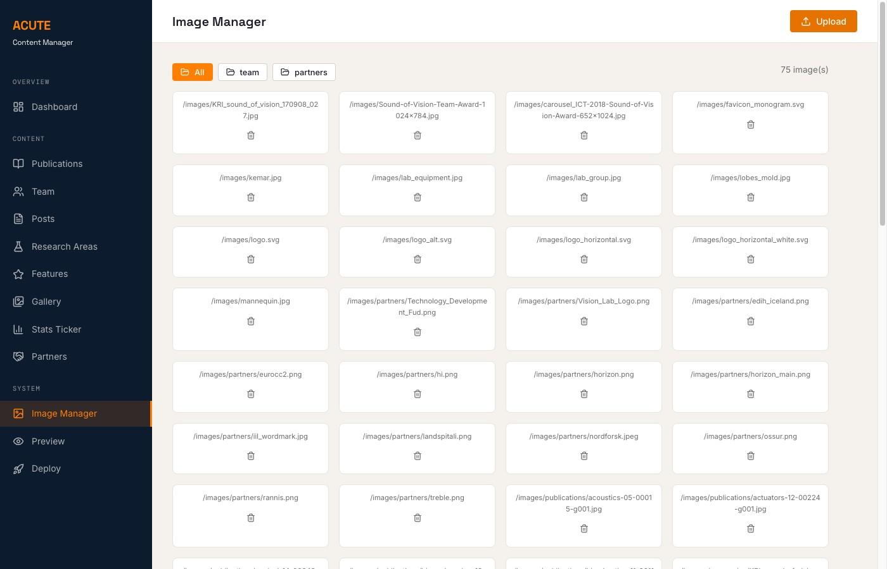

### Browsing images

Use the filter tabs at the top:
- **All** — every image on the site
- **team** — team member photos
- **partners** — partner and funder logos
- **projects** — project gallery photos (one subfolder per project, e.g. `projects/vibrosleeve/…`)

### Uploading images

1. Click the orange **Upload** button (top right)
2. Select one or more files
3. Images are automatically compressed depending on where they're uploaded:
   - **Team** photos: max 400×400, JPEG
   - **Partner** logos: max 300×150, PNG
   - **Project gallery** photos: max 1400 px wide, JPEG, with the **ACUTE watermark** stamped in the bottom-right (toggleable per-upload — see [Section 8](#8-managing-projects))
   - **Other** images: max 1200 px wide, JPEG

### Deleting images

Click the trash icon below any image and confirm.

---

## 14. Previewing the Website

Click **Preview** in the sidebar.

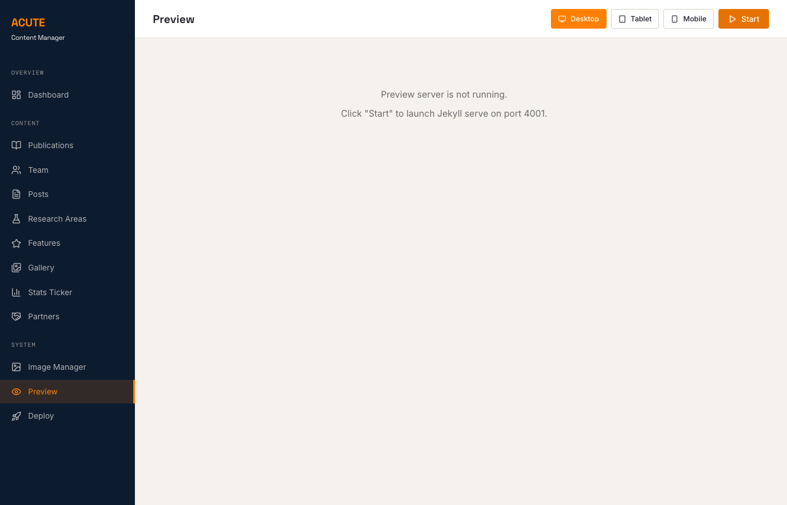

**Note:** This feature requires Ruby and Jekyll installed on your computer — this is the optional **Stage D** from [Getting Started](#1-getting-started). You can skip it entirely and your changes will still work after publishing.

**Installing Ruby + Jekyll (if you want Preview):**

In the commands below, replace `<your website folder>/acute_web` with the actual path to your cloned website (e.g. `/d/work/acute_web`).

| OS | How to install |
|----|---------------|
| **Windows** | Download [RubyInstaller](https://rubyinstaller.org/) (Ruby+Devkit version). After install, open a new Git Bash and run: `gem install jekyll bundler` then `cd <your website folder>/acute_web && bundle install` |
| **macOS** | Ruby is pre-installed. Run: `gem install jekyll bundler` then `cd <your website folder>/acute_web && bundle install` |

**Using Preview:**

1. Click the orange **Start** button
2. Wait for Jekyll to build the site (may take 10-20 seconds the first time)
3. The website appears in the preview area
4. Use the **Desktop / Tablet / Mobile** buttons to test different screen sizes
5. Click **Stop** when done

Every time you save content in the CMS, the preview updates automatically.

**If you don't have Ruby installed**, skip this step — just publish your changes and check the live website instead.

---

## 15. Publishing Your Changes

When you're happy with your edits, click **Deploy** in the sidebar.

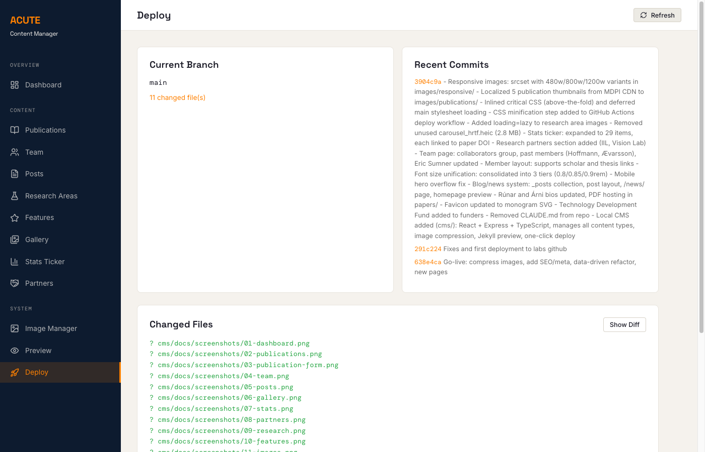

### Step 1: Review your changes

- **Changed Files** shows everything you've modified
- Click **Show Diff** to see exactly what changed

### Step 2: Commit and push

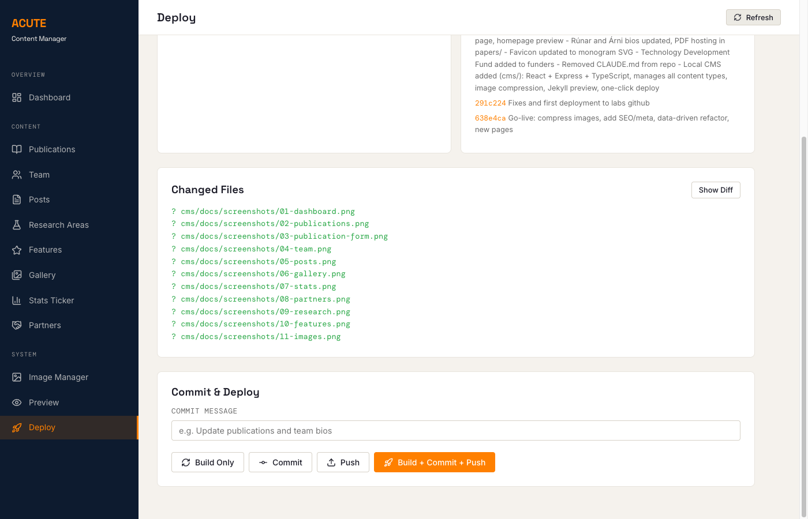

1. Type a short **commit message** describing your changes (e.g. "Add new publication by Karimi et al.")
2. Click **Commit** to save your changes locally
3. Click **Push** to publish to GitHub

Or use the orange **Build + Commit + Push** button to do everything in one click.

After pushing, the website updates automatically.

### Important

- Always **pull the latest changes** before starting work (`git pull origin main` in terminal)
- Write clear commit messages so others know what changed
- Only one person should edit at a time to avoid conflicts

---

## 16. Troubleshooting

### The CMS won't start

- Make sure you're in the `cms/` directory
- Run `npm install` again to ensure dependencies are up to date
- Check that Node.js 20+ is installed: `node --version`
- **Windows:** Make sure you're using **Git Bash**, not Command Prompt (cmd). The CMS may not work correctly in cmd.

### Changes don't appear on the live site

- Make sure you committed AND pushed (check the Deploy page)
- Wait a minute — the site may take a moment to update after pushing

### Preview doesn't work

- Preview requires Ruby and Jekyll installed locally
- If you don't have them, skip preview — your changes will still work after pushing

### "Merge conflict" error when pushing

- This means someone else edited the same file at the same time
- Ask a team member with git experience to help resolve it
- To avoid this: always `git pull` before starting, and coordinate with colleagues

### "Permission denied (publickey)" when pushing

- Your SSH key is not set up for GitHub
- Follow [Section 2: Setting Up SSH for GitHub](#2-setting-up-ssh-for-github) to create and add your key
- If you've already set up a key, try running `ssh-add ~/.ssh/id_ed25519` in your terminal, then try again
- If the issue persists, ask Stefanos for help

### "Access denied" / "you don't have access" when pushing (but your key works)

This is **different** from the "publickey" error above. Here GitHub *recognises* you — your key is fine — but says you're not allowed to push. The error looks like:

```
ERROR: Permission to Acute-hi-is/Acute-hi-is.github.io.git denied to SOMEUSERNAME.
```

The **username** in that message is the key to diagnosing it. First, find out which GitHub account your computer is actually using — in your terminal run:

```bash
ssh -T git@github.com
```

It replies `Hi USERNAME! You've successfully authenticated…`. Compare that `USERNAME` with the account you expect. There are two common causes:

**Cause 1 — You only have read access (most common).**
The username is *correct* (it's your account), but you were added to the organisation without write permission on this repository. Being an organisation member gives **read** access to repos by default — it does **not** automatically grant **write** (push) access. Ask Stefanos to grant you **Write** access on the website repo specifically:

> Repo → **Settings → Collaborators and teams** → **Add people** → your username → role **Write**.

Once that's done, pushing works — no changes needed on your computer.

**Cause 2 — Your SSH key is on the wrong GitHub account.**
The username is **not** the account you expected (e.g. you have two GitHub accounts and set the key up on the other one). A single SSH key can belong to only one account, and GitHub decides who you are from the key — so pushes go out as the wrong account, which has no access. To fix:

1. Log into GitHub as the **wrong** account → **Settings → SSH and GPG keys** → delete the key that matches your computer.
2. Log into GitHub as the **correct** account (the one with repo access) → **Settings → SSH and GPG keys** → **New SSH key** → paste the output of `cat ~/.ssh/id_ed25519.pub`.
3. Run `ssh -T git@github.com` again — it should now greet you as the correct account. Then retry the push.

If both could apply (wrong account *and* read-only), fix the account first, then make sure that account has **Write** access (Cause 1).

### I accidentally created a duplicate team member (or project)

If you see **two entries with the same name**, one was probably created with **+ Add Member** when you meant to **edit** the existing one. To fix:

- Delete the **duplicate** you just created (trash icon on the Team page), and instead click the **pencil** icon on the original entry to make your changes.
- Keep the **original** entry where possible — deleting and re-adding changes the member's page address (`/team/<name>/`) and drops links such as their research project.
- If the duplicate was never pushed, you can also just discard your local changes and start again from the original.

### Images look wrong or don't upload

- Supported formats: JPEG, PNG, SVG, WebP
- Images are auto-compressed on upload — the original is not kept
- Maximum recommended size before upload: 10 MB

---

## Good to Know — How Content Connects

A few things are linked behind the scenes, so you don't have to enter the same thing twice — and a couple of places where you *do* still need to keep two spots in sync.

**Publications are entered once, shown everywhere.**
Every paper lives in the **Publications** section. From there it automatically appears wherever it's referenced — you never retype a citation:

- **Project pages** — tick a paper's **Projects** (in the Publications editor).
- **Research area pages** — pick the paper in that area's **Key Publications** (in the Research Areas editor).
- **Homepage "Featured Research"** — the citation line under each feature is pulled from the paper's DOI.

So if you fix a title or author in Publications, it updates in all of those at once. If a paper isn't showing somewhere, it's almost always because it hasn't been added to **Publications** yet.

**Two places you still keep in sync manually** (these use free text on purpose, so they can include people/organisations that aren't in the CMS lists):

- **Project team vs. team profiles.** A project's **Team** field is a free-text list (it can include external collaborators). It is *separate* from the people in the **Team** section. If someone joins or leaves a project, update the project's Team field — and, for an ACUTE member, their profile's **Research Project** if it's their main one.
- **Partners.** Partner and funder **logos** are managed in the **Partners** section; a project's **Partners** / **Funding** fields are free text. Keep the names spelled consistently between them.

**One file to ignore:** `_data/sources.yaml` is *not* the publications list — it's a separate file for a future automated-citation tool and the website doesn't use it. Always add papers in the **Publications** section, not there.

---

## Quick Reference

| Task | Where | Button |
|------|-------|--------|
| Add a publication | Publications page | + Add |
| Add a team member | Team page | + Add Member |
| Add a project | Projects page | + Add Project |
| Add a project gallery item | Projects → edit a project → tick "Show photo & video gallery" | + Add Photo / + Add Video |
| Add a facility | Facilities page | + Add Facility |
| Write a blog post | Posts page | + New Post |
| Upload an image | Image Manager | Upload |
| Reorder items | Gallery / Stats / Features / Project gallery | Up/Down arrows |
| Preview the site | Preview page | Start |
| Publish changes | Deploy page | Build + Commit + Push |

**Website:** [https://acute.hi.is](https://acute.hi.is)

**Start the CMS:** `cd cms && npm run dev` then open http://localhost:3000
