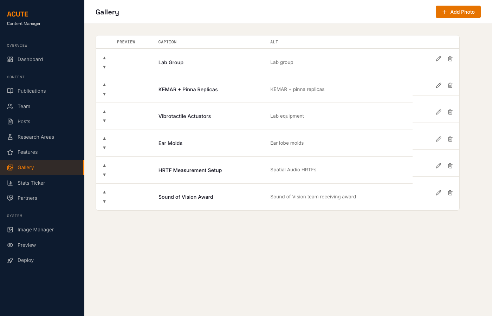

# ACUTE Lab Website — Content Management Guide

This guide explains how to use the ACUTE Content Manager (CMS) to edit the lab website without touching code.

---

## Table of Contents

1. [Getting Started](#1-getting-started)
2. [Setting Up SSH for GitHub](#2-setting-up-ssh-for-github)
3. [The Dashboard](#3-the-dashboard)
4. [Managing Publications](#4-managing-publications)
5. [Managing Team Members](#5-managing-team-members)
6. [Managing Blog Posts](#6-managing-blog-posts)
7. [Managing Research Areas](#7-managing-research-areas)
8. [Managing Projects](#8-managing-projects)
9. [Managing Featured Research](#9-managing-featured-research)
10. [Managing the Homepage Gallery](#10-managing-the-homepage-gallery)
11. [Managing the Stats Ticker](#11-managing-the-stats-ticker)
12. [Managing Partners & Funders](#12-managing-partners--funders)
13. [Image Manager](#13-image-manager)
14. [Previewing the Website](#14-previewing-the-website)
15. [Publishing Your Changes](#15-publishing-your-changes)
16. [Troubleshooting](#16-troubleshooting)

---

## 1. Getting Started

### Prerequisites

You need the following installed on your computer:

- **Node.js** (version 20 or higher) — [download here](https://nodejs.org) (Windows: use the `.msi` installer, keep all defaults)
- **Git** — [download here](https://gitforwindows.org/) (Windows: install "Git for Windows", keep all defaults — this includes Git Bash)
- **SSH key** — needed to publish changes to GitHub. See [Section 2: Setting Up SSH](#2-setting-up-ssh-for-github)
- **Ruby + Jekyll** — only needed for the Preview feature (optional, see [Section 14](#14-previewing-the-website))

### Which terminal to use

| Operating System | Terminal |
|-----------------|----------|
| **Windows** | Open **Git Bash** (installed with Git for Windows). Right-click on your desktop and select "Git Bash Here", or search for "Git Bash" in the Start menu. |
| **macOS** | Open **Terminal** (Applications > Utilities > Terminal) |

All commands in this guide work in both Git Bash (Windows) and Terminal (macOS).

### First-Time Setup

1. **Clone the repository** (only the first time):

```bash
cd ~/Documents
git clone git@github.com:Acute-hi-is/Acute-hi-is.github.io.git acute_web
```

2. **Install CMS dependencies**:

```bash
cd acute_web/cms
npm install
```

This only needs to be done once (or after updates to the CMS).

### Starting the CMS

Every time you want to edit content:

```bash
cd ~/Documents/acute_web
git pull origin main       # get the latest changes
cd cms
npm run dev                # start the CMS
```

Open your browser and go to **http://localhost:3000**

### Stopping the CMS

Press **Ctrl+C** in the terminal.

---

## 2. Setting Up SSH for GitHub

To publish changes from the CMS, your computer needs an SSH key linked to your GitHub account. You only need to do this **once per computer**.

If you can already push to GitHub (test with `ssh -T git@github.com`), skip this section.

### Step 1: Open your terminal

- **Windows:** Open **Git Bash** (search for it in the Start menu)
- **macOS:** Open **Terminal** (Applications > Utilities > Terminal)

### Step 2: Check if you already have an SSH key

Type:

```bash
ls ~/.ssh/id_ed25519.pub
```

- If you see a file path, **you already have a key** — skip to Step 4
- If you see "No such file or directory", continue to Step 3

### Step 3: Generate a new SSH key

Type (replace with your email):

```bash
ssh-keygen -t ed25519 -C "your-name@hi.is"
```

You will be asked three questions. **Press Enter for all three** to accept the defaults:

```
Enter file in which to save the key (/c/Users/YourName/.ssh/id_ed25519): [press Enter]
Enter passphrase (empty for no passphrase): [press Enter]
Enter same passphrase again: [press Enter]
```

You should see output like:

```
Your identification has been saved in /c/Users/YourName/.ssh/id_ed25519
Your public key has been saved in /c/Users/YourName/.ssh/id_ed25519.pub
```

### Step 4: Copy your public key

Type:

```bash
cat ~/.ssh/id_ed25519.pub
```

This prints a long line starting with `ssh-ed25519 AAAA...` and ending with your email.

**Select the entire line** and copy it:
- **Windows (Git Bash):** select with mouse, right-click > Copy (or Ctrl+Insert)
- **macOS:** select with mouse, Cmd+C

### Step 5: Add the key to GitHub

1. Open your browser and go to: **https://github.com/settings/keys**
   - If you're not logged in, log in first
2. Click the green **New SSH key** button
3. Fill in:
   - **Title**: a name for this computer (e.g. "Lab laptop" or "Office PC")
   - **Key type**: keep as "Authentication Key"
   - **Key**: paste the key you copied in Step 4
4. Click **Add SSH key**
5. GitHub may ask you to confirm your password

### Step 6: Test the connection

Back in your terminal, type:

```bash
ssh -T git@github.com
```

If this is your first time connecting, you'll see:

```
The authenticity of host 'github.com' can't be established.
Are you sure you want to continue connecting (yes/no)?
```

Type **yes** and press Enter.

You should then see:

```
Hi YourUsername! You've successfully authenticated, but GitHub does not provide shell access.
```

If you see this message, **you're done**. You can now push changes from the CMS.

If it doesn't work, see [Section 16: Troubleshooting](#16-troubleshooting).

---

## 3. The Dashboard

When you open the CMS, you land on the **Dashboard**.


The dashboard shows:

- **Content counts** — how many publications, team members, posts, and research areas exist
- **Quick Actions** — shortcuts to create new content or deploy changes
- **Git Status** — whether you have unsaved (uncommitted) changes

---

## 4. Managing Publications

Click **Publications** in the sidebar.


### What you see

- A list of all publications sorted by year (newest first)
- **Filter buttons** at the top: All, Haptics, Acoustics, Perception
- Each row shows the title, authors, year, topic badge, and a DOI link

### Adding a new publication

1. Click the orange **+ Add** button (top right)
2. Fill in the form:


| Field | What to enter |
|-------|--------------|
| Title | Full paper title |
| Authors | Author names, comma-separated (e.g. "I. Makarov, R. Unnthorsson") |
| Venue | Journal or conference name |
| Year | Publication year |
| DOI | The DOI identifier (e.g. "10.3390/s25010001") |
| Topic | Select: Haptics, Acoustics, or Perception |
| Summary | A 1-2 sentence description of the paper |
| Image URL | Optional — path to a thumbnail image |
| PDF Path | Optional — path to a locally hosted PDF |

3. Click **Save**

### Editing a publication

Click the pencil icon on any row. The form opens with the current values. Make your changes and click **Save**.

### Deleting a publication

Click the trash icon on any row. A confirmation dialog appears — click **Delete** to confirm.

---

## 5. Managing Team Members

Click **Team** in the sidebar.


Members are grouped into **Current Members** and **Past Members**.

### Adding a new team member

1. Click **+ Add Member** (top right)
2. Fill in:
   - **Name** — full name
   - **Role** — e.g. "PhD Candidate", "Postdoctoral Researcher"
   - **Photo** — click Upload to add a photo (auto-compressed to 400x400)
   - **Email** — optional
   - **Profile URL** — optional link to university page
   - **Status** — "current" or "past"
   - **Order** — display order (lower numbers appear first)
   - **Bio** — write in the text area. This supports Markdown formatting
3. Click **Save**

### Moving a member to "Past"

Edit the member, change **Status** from "current" to "past", and save.

### Editing a bio

Click the pencil icon on any member. The bio field supports Markdown:

- `**bold text**` for bold
- `*italic text*` for italic
- `[link text](url)` for links
- Blank lines for new paragraphs

---

## 6. Managing Blog Posts

Click **Posts** in the sidebar.


### Adding a new post

1. Click **+ New Post** (top right)
2. Fill in:
   - **Title** — the post headline
   - **Date** — publication date
   - **Category** — e.g. "publication", "lab", "event"
   - **Excerpt** — a short summary (shown on the homepage)
   - **Content** — the full post body (Markdown supported)
3. Click **Save**

The post filename is auto-generated from the date and title.

---

## 7. Managing Research Areas

Click **Research Areas** in the sidebar.


Each research area has a title, summary, description paragraphs, and linked publications.

### Editing a research area

1. Click the pencil icon on any row
2. The form includes:
   - **Title** and **Summary**
   - **Description** — multiple paragraphs (use Add/Remove buttons to manage)
   - **Publications** — linked papers with text and DOI (use Add/Remove buttons)
   - **Images** — main image and highlight image
3. Click **Save**

---

## 8. Managing Projects

Click **Projects** in the sidebar.


Each project gets its own page at `acute.hi.is/projects/<slug>/`. Projects are sorted by **Display Order** (lower numbers first) on the projects index page, and each can optionally show a **photo & video gallery** at the bottom of its detail page.

> **Don't confuse this with the homepage Gallery** (Section 10). That one drives the carousel of lab photos on the homepage. *This* gallery lives inside an individual project's page and is opt-in per project.

### Adding a new project

1. Click the orange **+ Add Project** button (top right)
2. Fill in:

| Field | What to enter |
|-------|--------------|
| Title | Project title |
| Status | "Active", "Completed", or "Emerging". Drives the badge colour on the projects index. |
| Tags | Comma-separated keywords (e.g. "Haptics, Wearables"). Shown as chips on the index card. |
| Display Order | Lower numbers appear first on the projects index. |
| Team | People involved (free text — e.g. "Stefanos V., Runar U.") |
| Partners | Collaborating institutions or companies |
| Funding | Grant / funder names |
| Description | Body content in **Markdown**. Appears as the main column of the project page. |
| Key Publications | Optional. Add citation text, venue, and DOI for each — they render as a list in the project sidebar. |

3. Click **Save**

### Adding a photo & video gallery

Each project page can show an optional gallery at the bottom.

1. Edit the project
2. Tick **"Show photo & video gallery on this project page"**
3. The **Gallery Items** editor appears. Click **+ Add Photo** or **+ Add Video** to add an item
4. Reorder items with the ▲ ▼ arrows on each row; delete with the ✕

**For photo items:**

- Click **Upload** to add an image. Uploaded photos are auto-compressed to max 1400 px wide, JPEG.
- A **"Apply ACUTE watermark to next upload"** checkbox appears above the upload button — leave it checked (the default) to stamp the ACUTE long logo discreetly in the bottom-right corner of the image. Uncheck only if you don't want a watermark on that specific upload (e.g. partner-supplied images that already carry their own branding).
- Fill in **Alt text** (for accessibility) and an optional **Caption** (shown beneath the photo on the live page).

**For video items:**

- Paste an **embed URL** — not the watch URL. YouTube and Vimeo both expose this:
  - YouTube: from `https://www.youtube.com/watch?v=ABC123` → use `https://www.youtube.com/embed/ABC123`
  - Vimeo: from `https://vimeo.com/123456` → use `https://player.vimeo.com/video/123456`
- Add an optional **Caption**.
- Videos render as a responsive 16:9 embed in the gallery grid.

5. Click **Save**

### Disabling the gallery

Untick **"Show photo & video gallery on this project page"** and save. The gallery items are preserved (in case you want to re-enable later) — they just won't render on the live page.

### Editing or deleting a project

Click the pencil icon on any row to edit, or the trash icon (with confirmation) to delete. Deleting a project removes its source file; uploaded gallery images stay in the repo and can be cleaned up via the [Image Manager](#13-image-manager).

---

## 9. Managing Featured Research

Click **Features** in the sidebar.


These are the highlighted research sections on the homepage.

### Reordering

Use the up/down arrows on the left of each row to change the display order.

### Editing a feature

Click the pencil icon. You can change the label, title, description text, DOI link, image, and layout direction (Normal or Reversed).

---

## 10. Managing the Homepage Gallery

Click **Gallery** in the sidebar.



The gallery controls the **photo carousel on the homepage**. (For galleries that live inside an individual project page, see [Section 8: Managing Projects](#8-managing-projects) instead.)

### Adding a photo

1. Click **+ Add Photo** (top right)
2. Set the **image path** (type it or use Upload)
3. Add a **caption** and **alt text** (for accessibility)
4. Click **Save**

### Reordering photos

Use the up/down arrows to change the carousel order.

---

## 11. Managing the Stats Ticker

Click **Stats Ticker** in the sidebar.


The stats ticker is the scrolling numbers bar on the homepage.

### Adding a stat

1. Click **+ Add Stat** (top right)
2. Enter the **Number** (e.g. "93%", "200 Hz", "34 dB")
3. Enter the **Label** (description of what the number means)
4. Click **Save**

### Reordering

Use the up/down arrows to change the scroll order.

---

## 12. Managing Partners & Funders

Click **Partners** in the sidebar.


Partners are organized in three tabs:

- **Research** — academic research partners
- **Industry** — industry collaborators
- **Funders** — funding organizations

### Adding a partner

1. Select the correct tab
2. Click the orange **+ Add to [group]** button
3. Fill in the name, website URL, logo (use Upload), and alt text
4. Click **Save**

Logos are auto-compressed to 300x150 pixels.

---

## 13. Image Manager

Click **Image Manager** in the sidebar.


### Browsing images

Use the filter tabs at the top:
- **All** — every image on the site
- **team** — team member photos
- **partners** — partner and funder logos
- **projects** — project gallery photos (one subfolder per project, e.g. `projects/vibrosleeve/…`)

### Uploading images

1. Click the orange **Upload** button (top right)
2. Select one or more files
3. Images are automatically compressed depending on where they're uploaded:
   - **Team** photos: max 400×400, JPEG
   - **Partner** logos: max 300×150, PNG
   - **Project gallery** photos: max 1400 px wide, JPEG, with the **ACUTE watermark** stamped in the bottom-right (toggleable per-upload — see [Section 8](#8-managing-projects))
   - **Other** images: max 1200 px wide, JPEG

### Deleting images

Click the trash icon below any image and confirm.

---

## 14. Previewing the Website

Click **Preview** in the sidebar.


**Note:** This feature requires Ruby and Jekyll installed on your computer. This is optional — you can skip it and your changes will still work after publishing.

**Installing Ruby + Jekyll (if you want Preview):**

| OS | How to install |
|----|---------------|
| **Windows** | Download [RubyInstaller](https://rubyinstaller.org/) (Ruby+Devkit version). After install, open a new Git Bash and run: `gem install jekyll bundler` then `cd ~/Documents/acute_web && bundle install` |
| **macOS** | Ruby is pre-installed. Run: `gem install jekyll bundler` then `cd ~/Documents/acute_web && bundle install` |

**Using Preview:**

1. Click the orange **Start** button
2. Wait for Jekyll to build the site (may take 10-20 seconds the first time)
3. The website appears in the preview area
4. Use the **Desktop / Tablet / Mobile** buttons to test different screen sizes
5. Click **Stop** when done

Every time you save content in the CMS, the preview updates automatically.

**If you don't have Ruby installed**, skip this step — just publish your changes and check the live website instead.

---

## 15. Publishing Your Changes

When you're happy with your edits, click **Deploy** in the sidebar.


### Step 1: Review your changes

- **Changed Files** shows everything you've modified
- Click **Show Diff** to see exactly what changed

### Step 2: Commit and push


1. Type a short **commit message** describing your changes (e.g. "Add new publication by Karimi et al.")
2. Click **Commit** to save your changes locally
3. Click **Push** to publish to GitHub

Or use the orange **Build + Commit + Push** button to do everything in one click.

After pushing, the website updates automatically.

### Important

- Always **pull the latest changes** before starting work (`git pull origin main` in terminal)
- Write clear commit messages so others know what changed
- Only one person should edit at a time to avoid conflicts

---

## 16. Troubleshooting

### The CMS won't start

- Make sure you're in the `cms/` directory
- Run `npm install` again to ensure dependencies are up to date
- Check that Node.js 20+ is installed: `node --version`
- **Windows:** Make sure you're using **Git Bash**, not Command Prompt (cmd). The CMS may not work correctly in cmd.

### Changes don't appear on the live site

- Make sure you committed AND pushed (check the Deploy page)
- Wait a minute — the site may take a moment to update after pushing

### Preview doesn't work

- Preview requires Ruby and Jekyll installed locally
- If you don't have them, skip preview — your changes will still work after pushing

### "Merge conflict" error when pushing

- This means someone else edited the same file at the same time
- Ask a team member with git experience to help resolve it
- To avoid this: always `git pull` before starting, and coordinate with colleagues

### "Permission denied (publickey)" when pushing

- Your SSH key is not set up for GitHub
- Follow [Section 2: Setting Up SSH for GitHub](#2-setting-up-ssh-for-github) to create and add your key
- If you've already set up a key, try running `ssh-add ~/.ssh/id_ed25519` in your terminal, then try again
- If the issue persists, ask Stefanos for help

### Images look wrong or don't upload

- Supported formats: JPEG, PNG, SVG, WebP
- Images are auto-compressed on upload — the original is not kept
- Maximum recommended size before upload: 10 MB

---

## Quick Reference

| Task | Where | Button |
|------|-------|--------|
| Add a publication | Publications page | + Add |
| Add a team member | Team page | + Add Member |
| Add a project | Projects page | + Add Project |
| Add a project gallery item | Projects → edit a project → tick "Show photo & video gallery" | + Add Photo / + Add Video |
| Write a blog post | Posts page | + New Post |
| Upload an image | Image Manager | Upload |
| Reorder items | Gallery / Stats / Features / Project gallery | Up/Down arrows |
| Preview the site | Preview page | Start |
| Publish changes | Deploy page | Build + Commit + Push |

**Website:** [https://acute.hi.is](https://acute.hi.is)

**Start the CMS:** `cd cms && npm run dev` then open http://localhost:3000
